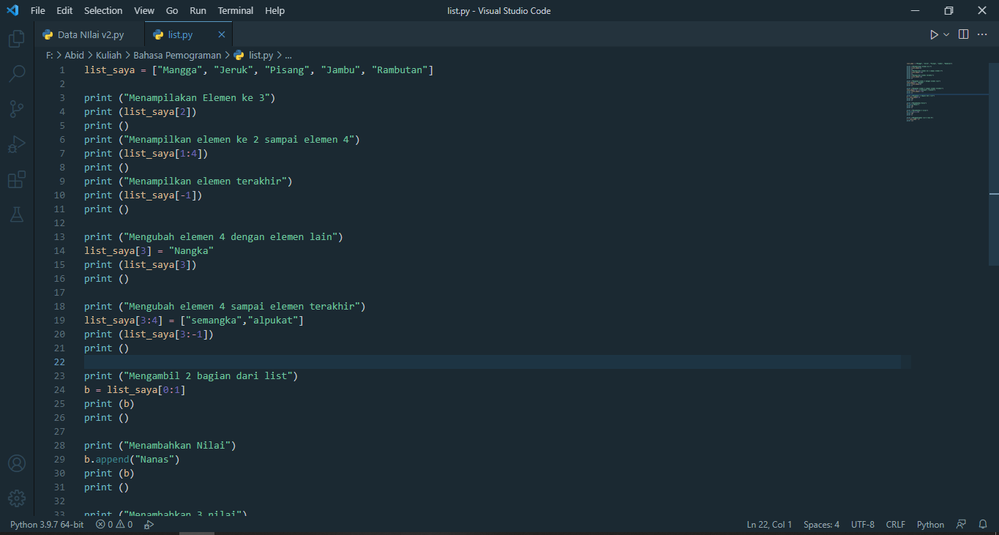

# Labspy04

## 1. Program Menambahkan Data Ke dalam List



### Penjelasan 
 - (Deklarasi list) ketika menginput data, maka data akan dimasukan ke dalam list ini

 ```bash
list_nama = []
list_nim = []
list_uts = []
list_tugas = []
list_uas = [] 
rata = []
 ```

 - Membuat program perulangan menggunakan while loop dengan nilai True

 ```bash
 while True:
 ```
- Pada variabel list_nama.append dan list_nim.append inputan akan ditambahkan ke dalam list dengan method .append, sedangkan untuk nilai(Tugas, UTS dan UAS) dimasukan ke variable rata.append terlebih dahulu untuk di jumlahkan

```bash
list_nama.append(str(input("Masukan Nama\t\t : ")))
    list_nim.append(int(input("Masukan NIM\t\t : ")))
    tugas = int(input("Masukan Nilai Tugas\t : "))
    list_tugas.append(tugas)
    uts = int(input("Masukan Nilai UTS\t : "))
    list_uts.append(uts)
    uas = int(input("Masukan Nilai UAS\t : "))
    list_uas.append(uas)
    rata.append(tugas * 30/100 + uts * 35/100 + uas * 35/100)
```
- Program input tanya [y/t], apabila jawaban t atau T, maka program inputan dihentikan statement break dan akan menampilkan data yang sudah diinput

```bash
 n = input("Lanjut (Y/T)\t\t : ")
    if n == "t" or n == "T":
        break
print ()
```

- Untuk membuat header table, menggunakan print(68*"="), fungsinya membuat "=" sebanyak 68 sebagai garis, dan menggunakan format string agar terlihat bagus dan rapih.

```bash
print (68*"=")
print("| {0:^3} | {1:^12} | {2:^9} | {3:^5} | {4:^5} | {5:^5} | {6:^7} |".format("NO", "NAMA", "NIM" , "TUGAS", "UTS", "UAS", "AKHIR"))
print (68*"=")
```

- Membuat isi table sesuai dengan inisialisi diatas, dengan format string agar terlihat rapih

```bash
no = 0
for nama, nim, tugas, uts, uas, akhir in zip (list_nama, list_nim, list_tugas, list_uts, list_uas, rata):
    no += 1
    print ("| {0:>3} | {1:<12} | {2:>9} | {3:>5} | {4:>5} | {5:>5} | {6:>7} |".format(no, nama, nim, tugas, uts, uas, akhir))
print (68*"=")
```
- ### Output

[img 2](screenshot/4.png)